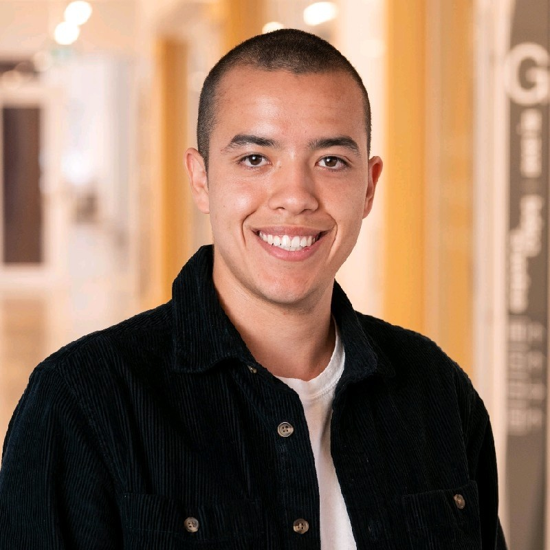

<!--

<h3 style="font-color: darkgreen;">NEWS: Camera-ready of accepted papers & speakers slides are online</h3>

-->

----
<a name="toc"/>

<!-- <a href="#videos">Videos</a> &middot;   -->
<a href="#overview">Overview</a> &middot;
<a href="#speakers">Invited Speakers</a> &middot;
<!-- <a href="#call">Call for Contributions</a> &middot; -->
<a href="#dates">Important Dates</a> &middot;
<!-- <a href="#papers">Accepted Papers</a> &middot; -->
<a href="#schedule">Schedule</a> &middot;
<a href="#organizers">Organizers</a>

----

<a name="toc"/>

<!-- ## Updates -->

<!--  -->

<!-- **2022 July:** Workshop was submitted to CoRL. -->

<!-- <a name="videos"/>
## Videos <a href="#toc" class="top-link">[Top]</a>

TODO -->

<a name="overview"/>

## Overview <a href="#toc" class="top-link">[Top]</a>

Legged robots (bipeds, robot dogs, hexapods) are incredibly versatile but this versatility comes with more complex control problems than their wheeled counterparts. The goal of the workshop is to give a platform to researchers who are using machine learning techniques on legged robots to share their problems and ideas. We’ll look at the problem from the angles of learned controllers, learned perception, developing simulators, and designing physical systems.

<a name="speakers"/>

## Invited Speakers <a href="#toc" class="top-link">[Top]</a>

|  | [Sergey Levine](https://people.eecs.berkeley.edu/~svlevine/) (UC Berkley)

|  | [Vladlen Koltun](http://vladlen.info/) (Apple)

|  | [Dhruv Batra](https://faculty.cc.gatech.edu/~dbatra/) (Georgia Tech)

|  | [Sethu Vijayakumar](https://homepages.inf.ed.ac.uk/svijayak/) (University of Edinburgh)

|  | [Animesh Garg](https://animesh.garg.tech/) (University of Toronto)

|  | [Timothy H. Chung ](https://scholar.google.ca/citations?user=iI4rhYAAAAAJ&hl=en) (DARPA)

|  | [Danijar Hafner](https://danijar.com/) (University of Toronto)

|  | [Hsiu-Chin Lin](https://sites.google.com/site/hsiuchinlin/) (McGill University)

|  | [Joonho Lee](https://rsl.ethz.ch/the-lab/people/person-detail.MjEzNzM5.TGlzdC8yNDQyLC0xNDI1MTk1NzM1.html) (ETH Zurich)

|  | [Damian Lickindorf](https://www.linkedin.com/in/damian-lickindorf-4aa91b160/) (Ahead.io)

<!-- <a name="call"/>

## Call for Contributions <a href="#toc" class="top-link">[Top]</a>

Participants are invited to submit extended abstracts (maximum 2 pages in length, excluding references). We encourage both position papers as well general sim2real submissions.

Accepted abstracts will receive a poster presentation slot and selected submissions will additionally be allowed to give a spotlight presentation for 5min each, ahead of the debate that's most in line with the subject.

Submissions must be in PDF format following the [IEEE style](https://www.ieee.org/conferences/publishing/templates.html).  Submissions must include a short abstract. The extended abstract should go in the main section of the template and the short abstract in the abstract section.

Submission website: [TODO](TODO)
 -->

<a name="dates"/>

## Important dates <a href="#toc" class="top-link">[Top]</a>

* Paper Submission Deadline: TBD
* Acceptance Notification: TBD
* Workshop: Dec 15th, 2022 (full day)
* Main Conference: Dec 14th - 18th, 2022

<!-- <a name="papers"/>

## Accepted Papers <a href="#toc" class="top-link">[Top]</a>

* **"Title"** 
  Authors 
<a href="assets/papers/paper.pdf">[PDF]</a> -->

<a name="schedule"/>

## Schedule <a href="#toc" class="top-link">[Top]</a>

<table class="tg">
<thead>
  <tr>
    <th class="tg-0thz" style="width:120px">Timeslot</th>
    <th class="tg-0thz">Event</th>
    <th class="tg-0thz">Speakers</th>
  </tr>
</thead>
<tbody>
  <tr>
    <td class="tg-lboi">08:55 - 09:00</td>
    <td class="tg-lboi">Welcome</td>
    <td class="tg-lboi"></td>
  </tr>
  <tr>
    <td class="tg-lboi">09:00 - 09:30</td>
    <td class="tg-lboi">Invited Talk</td>
    <td class="tg-lboi">Hsui-Chin Lin</td>
  </tr>
  <tr>
    <td class="tg-lboi">09:90 - 10:00</td>
    <td class="tg-lboi">Invited Talk</td>
    <td class="tg-lboi">Animesh Garg</td>
  </tr>
  <tr>
    <td class="tg-lboi">10:00 - 10:30</td>
    <td class="tg-lboi">Papers Session 1</td>
    <td class="tg-lboi">TBD</td>
  </tr>
  <tr>
    <td class="tg-lboi">10:30 - 11:00</td>
    <td class="tg-lboi">Coffee Break & Poster Session 1</td>
    <td class="tg-lboi"></td>
  </tr>
  <tr>
    <td class="tg-lboi">11:00 - 11:40</td>
    <td class="tg-lboi">Keynote</td>
    <td class="tg-lboi">Joonho Lee</td>
  </tr>
  <tr>
    <td class="tg-lboi">11:40 - 12:00</td>
    <td class="tg-lboi">Invited Talk</td>
    <td class="tg-lboi">Damien Lickindorf</td>
  </tr>
  <tr>
    <td class="tg-lboi">12:00 - 13:00</td>
    <td class="tg-lboi">Lunch break</td>
    <td class="tg-lboi"></td>
  </tr>
  <tr>
    <td class="tg-lboi">13:00 - 13:40</td>
    <td class="tg-lboi">Keynote</td>
    <td class="tg-lboi">Dhruv Batra</td>
  </tr>
  <tr>
    <td class="tg-lboi">13:40 - 14:00</td>
    <td class="tg-lboi">Invited Talk</td>
    <td class="tg-lboi">Danijar Hafner</td>
  </tr>
  <tr>
    <td class="tg-lboi">14:00 - 14:30</td>
    <td class="tg-lboi">Papers Session 2</td>
    <td class="tg-lboi">TBD</td>
  </tr>
  <tr>
    <td class="tg-lboi">14:30 - 15:00</td>
    <td class="tg-lboi">Coffee Break & Poster Session 2</td>
    <td class="tg-lboi"></td>
  </tr>
  <tr>
    <td class="tg-lboi">15:00 - 15:40</td>
    <td class="tg-lboi">Keynote</td>
    <td class="tg-lboi">Timothy H Chung </td>
  </tr>
  <tr>
    <td class="tg-lboi">15:40 - 16:10</td>
    <td class="tg-lboi">Invited Talk</td>
    <td class="tg-lboi">Sergey Levine</td>
  </tr>
  <tr>
    <td class="tg-lboi">16:10 - 16:40</td>
    <td class="tg-lboi">Invited Talk</td>
    <td class="tg-lboi">Sethu Vijayakumar</td>
  </tr>
  <tr>
    <td class="tg-lboi">16:40 - 17:25</td>
    <td class="tg-lboi">Panel Discussion</td>
  </tr>
  <tr>
    <td class="tg-lboi">17:25 - 17:30</td>
    <td class="tg-lboi">Closing</td>
    <td class="tg-lboi"></td>
  </tr>
</tbody>
</table>

<a name="organizers"/>

## Organizers <a href="#toc" class="top-link">[Top]</a>

|   | [Florian Golemo](https://fgolemo.github.io/) is a postdoctoral fellow at Mila and ServiceNow, working with Liam Paull and Chris Pal on Sim2Real and 3D perception problems. He received his PhD from INRIA Bordeaux under supervision of Pierre-Yves Oudeyer.  |

|   | [Simon Chamorro](https://simonchamorro.github.io/) is a Msc. Student at Mila and Polytechnique Montreal advised by professor Chris Pal. He received his B. Eng in Robotics from the Université de Sherbrooke and works on planning, control and RL.  |

|   | [Charlie Gauthier](https://mila.quebec/en/person/charlie-gauthier/) is a Msc. Student at Mila and Université de Montreal advised by professor Liam Paull. She is interested in robotics, automation, and related learning algorithms (RL, IL, etc.).  |

|   | [Martin Weiss](http://martincsweiss.com/) is a PhD Student at Mila and Polytechnique Montreal advised by professor Chris Pal. He is interested in understanding the nature of intelligence, and developing intelligent systems for the benefit of humanity.  |

|   | [Glen Berseth](https://www.fracturedplane.com/) is an assistant professor at the Université de Montréal, a core academic member of the Mila - Quebec AI Institute, CIFAR AI chair, and co-director of the Robotics and Embodied AI Lab (REAL). The specific of his research has covered the areas of reinforcement-, continual-, meta-, hierarchical learning, and human-robot collaboration.  |

